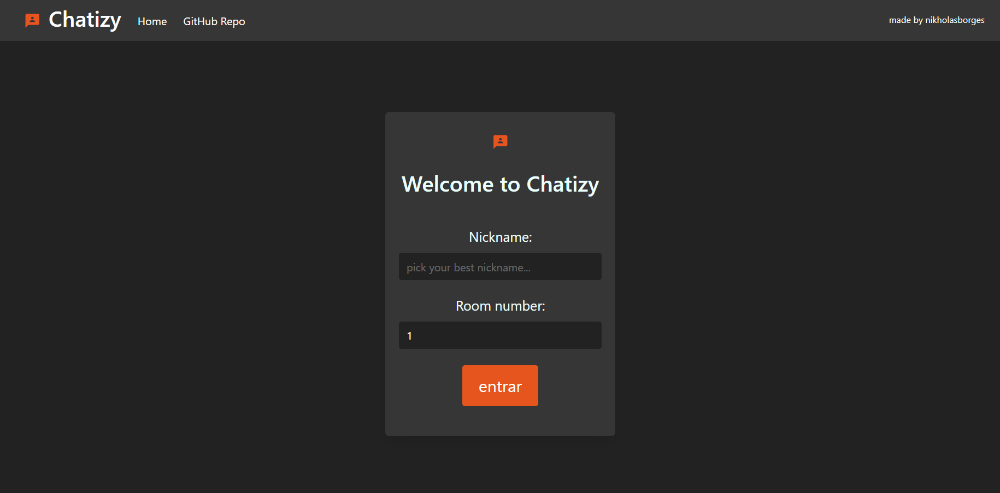
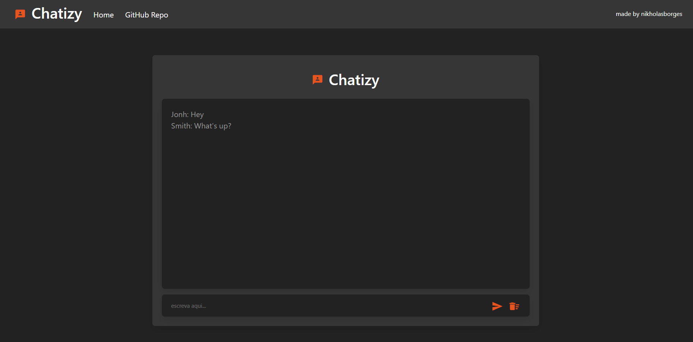

## Chat WebApp
A real-time chat web application made with Django and WebSockets

## Motivation
Project created to study Django apps development and implementation

## Features

- Real-time chat
- Implementation of WebSockets using the Channels library

## Screenshots




## Tech/framework used

Built with

- 
- 
- 
- 
- 

## How to use

1 - Download the Project:

2 - Run the batch file:
```
run_project.bat
```
3 - Enjoy! :)

## About

Project created with academic purposes only

## License

MIT © Copyright (c) 2020 nikholasborges
